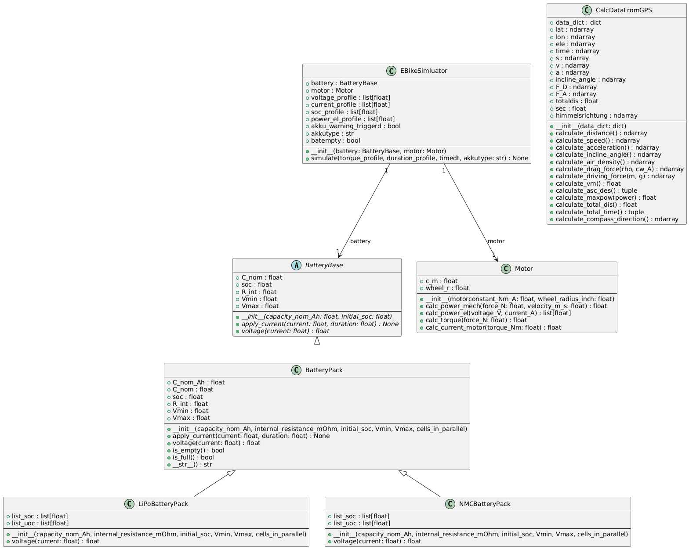

# ebike_final_project

Final project PRO1 SS2026 from Stefan Höllrigl and Pit Boden.

# E-Bike-Simulator

Dieses Projekt ist ein Simulator für ein E-Bike mit zwei verschiedenen Akkumodellen (Lipo und NMC). Es liest reale GPS-Messdaten aus einer CSV-Datei ein, mit denen verschiedenste Berechnungen und Plots erstellt wurden. Sie zeigen unter anderem den Unterschied zwischen den zwei Batteriemodellen und stellen die Eigenschaften des Fahrrads dar.

Das Ziel des Projekts ist es, den Unterschied zwischen den zwei Batteriemodellen darzustellen, verschiedene Plots und Studien mithilfe der realen Messwerte zu erstellen und die Fahrt zu simulieren.

# Systemvoraussetzungen:

Es muss in Python 3.14.3 gearbeitet werden und die Git Bash muss genutzt werden. 

# Diagramme: 

Aktivitätsdiagramm:

Klassendiagramm:

# Installation und Anleitung:

Folgende Schritte müssen befolgt werden, um das Projekt in einer virtuellen Umgebung auf dem PC einzurichten. Diese Befehle sind für die "Git Bash" optimiert:

Lade den ZIP-Ordner von Github runter, navigiere in den Ordner ebike_final_project und öffne die Git Bash:

1) ZIP-Ordner runterladen
2) in den Ornder ebike_final_project-main navigieren
3) Git Bash in diesem Ornder öffnen

Dann muss die virtuelle Umgebung erstellt und aktiviert werden mit den Befehlen:

4) python -m venv .venv
5) source .venv/Scripts/activate

Dann müssen die benötigten Pakete installiert werden mit:

6) pip install -r requirements.txt

# Bedienung:

Um die Simulation zu starten kann das Hauptprogramm mit dem folgenden Befehl in der "Git Bash" ausgeführt werden:

7) python main.py

Mit diesem Befehl öffnen sich alle Plots gleichzeitig und eine interaktive Karte mit dem Namen "height_map.html" wird im Ordner gespeichert. Es wird empfohlen die "height_map.html" in Chrome zu öffnen, weil sonst Fehler ausftreten können.
Mit der "esc-Taste" können alle Plots zusammen wieder geschlossen werden.
In der simulation.log Datei findet man die finalen Kennzahlen, Infos und Warnungen der Simulation.

