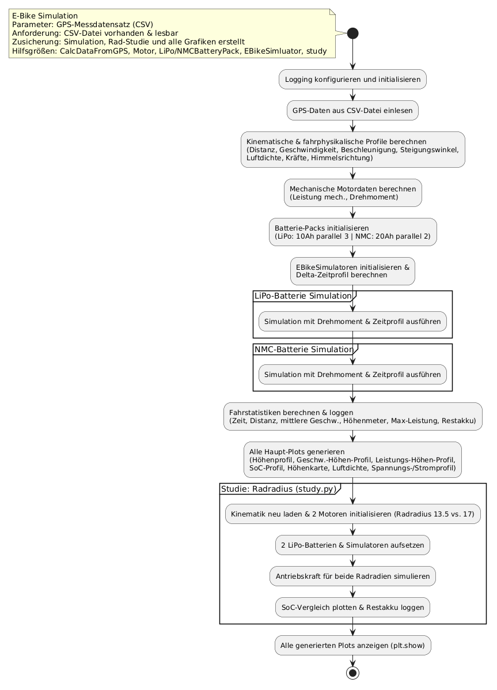

# ebike_final_project

Final project PRO1 SS2026 from Stefan Höllrigl and Pit Boden.

# E-Bike-Simulator

Dieses Projekt ist ein Simulator für ein E-Bike mit zwei verschiedenen Akkumodellen (Lipo und NMC). Es liest reale GPS-Messdaten aus einer CSV-Datei ein, mit denen verschiedenste Berechnungen und Plots erstellt wurden. Sie zeigen unter anderem den Unterschied zwischen den zwei Batteriemodellen und stellen die Eigenschaften des Fahrrads dar.

Das Ziel des Projekts ist es, den Unterschied zwischen den zwei Batteriemodellen darzustellen, verschiedene Plots und Studien mithilfe der realen Messwerte zu erstellen und die Fahrt zu simulieren.

# Systemvoraussetzungen:

Wir haben in Python 3.14.3 gearbeitet und die Git Bash benutzt. 

# Diagramme: 

Aktivitätsdiagramm:

Klassendiagramm

...

# Installation und Anleitung:

Folgende Schritte müssen befolgt werden, um das Projekt in einer virtuellen Umgebung auf dem PC einzurichten. Diese Befehle sind für die "Git Bash" optimiert:

Öffne deine Git Bash, navigiere in den gewünschten Arbeitsordner und klone das Projekt von GitHub wie folgt:

1) git clone https://github.com/hs6585/ebike_final_project.git
2) cd ebike_final_project

Dann muss die virtuelle Umgebung erstellt und aktiviert werden mit den Befehlen:

3) python -m venv .venv
4) source .venv/Scripts/activate

Dann müssen die benötigten Pakete installiert werden mit:

5) pip install -r requirements.txt

# Bedienung:

Um die Simulation zu starten kann das Hauptprogramm mit dem folgenden Befehl in der "Git Bash" ausgeführt werden:

6) python main.py

Mit diesem Befehl öffnen sich alle Plots gleichzeitig und eine interaktive Karte mit dem Namen "height_map.html" wird im Ordner gespeichert. Es wird empfohlen die "height_map.html" in Chrome zu öffnen, weil sonst Fehler ausftreten können.
Mit der "esc-Taste" können alle Plots zusammen wieder geschlossen werden.
In der simulation.log Datei findet man die finalen Kennzahlen, Infos und Warnungen der Simulation.

DAS NOCH LÖSCHEN!!!:

Chat hat gemeint, es ist besser, die datei lokal aufzurufen, weil manche links veralten können, und dann kann es sein, dass das diagramm danach nicht mehr funktioniert:

